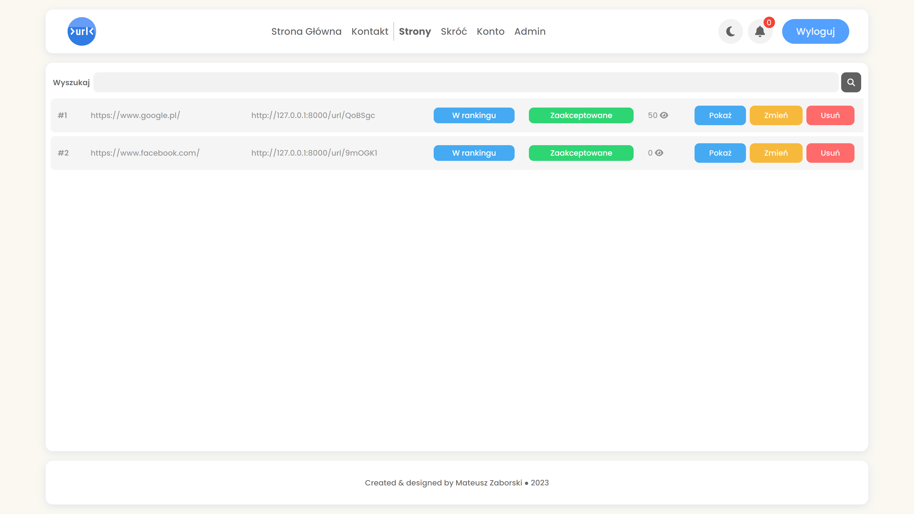
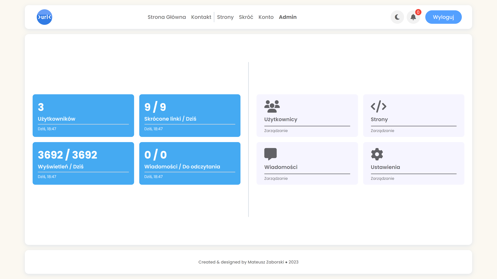

# Symfony-ShortUrl-Website

Simple website to shorten long urls after login


## Table of Contents

- [General Info](#general-info)
- [Technologies](#technologies)
- [Setup](#setup)
- [Project Status](#project-status)
- [Incoming Features](#incoming-features)
- [Acknowledgements](#acknowledgements)
- [Contact](#contact)

## General Info

This website has been developed using [PHP](https://www.php.net/), MySQL, and [Symfony](https://symfony.com/doc/current/setup.html). When logged in as a User, you have the ability to create shortened links and include them in the ranking. Additionally, you can modify your password. In the role of a Moderator, you possess the authority to delete websites. If the 'accepting links' setting is enabled, you can either approve or reject websites with a specific reason. Moreover, you have the ability to review and delete messages. As an Administrator, you enjoy comprehensive access. This includes managing user accounts - altering roles or blocking users. There's also a 'accepting links' setting, which only allows you to change the status.



## Technologies

- Symfony 6.1.2
- Twig 3.4.1
- PHP 8.1.7
- MySQL 8.0.29
- HTML 5
- CSS 3
- JavaScript
- SweetAlert 2
- FontAwesome 6.1.2

## Setup

To run this project you will need to install Symfony, PHP, [Composer](https://getcomposer.org/download/), [NPM](https://www.npmjs.com/package/npm), and MySQL on your local machine.

If you have everything you can run these commands:

```
# Clone this respository
> git clone https://github.com/Mati822456/Symfony-ShortUrl-Website.git

# Go into the respository
> cd Symfony-ShortUrl-Website

# Install dependencies from lock file
> composer install

# Install packages from package.json
> npm install

# Compile assets
> npm run dev
```

`In .env file change db_user, db_password, db_name`

```
# Start server
> symfony server:start

# Create database
> symfony console doctrine:database:create

# Load migrations
> symfony console doctrine:migrations:migrate

# Create admin, mod, user and some shortened links
> symfony console doctrine:fixtures:load

# Access using
http://localhost:8000
```

Now you can login using created accounts:

```
Role: Admin
Email: admin@db.com
Password: Admin1234

Role: Mod
Email: mod@db.com
Password: Mod1234

Role: User
Email: user@db.com
Password: User1234
```




## Project Status

I'm constantly working on this project. I want to add some new features. :)

## Incoming Features

- ~~new page dedicated to notifications to tell user which website was deleted or canceled and I want to add button with icon located next to login/logout button~~
- filtering pages, users and messages
- ~~new UI~~
- ~~pagination~~
- ~~RESTful~~
- asynchronous request
- ~~dark mode~~

## Acknowledgements

Icon by icons8.com
`https://icons8.com/icon/stdEXlVErsEe/shorten-urls`

## Contact

Feel free to contact me via email mateusz.zaborski1@gmail.com. :D
